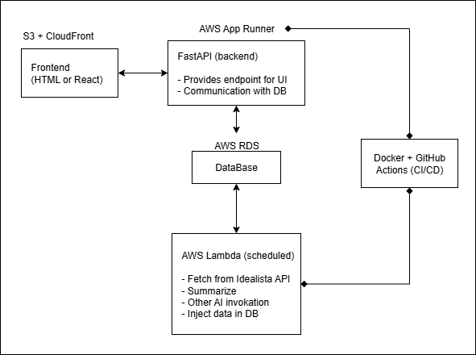

# STALK HOUSE MARKET

## Introduction
This open source application facilitates monitoring the Real State market in Spain. It integrates a robust solution relying Idealista REST API, AWS RDS, AWS Lambda, Python, FastAPI and LLMs. The purpose is to build a platform, with easy interaction, where the user can define certain market preferences for an autonomous search in a delimited region of interest. The user triggers a scheduled AWS Lambda function which retrieves properties from Idealista API, summarize the description and classify it according to the user's suitability. In addition to this, an Agentic AI sweeps web search engine to fetch information about the neighbourhood (news, opinions, historical data).

The communication is based on FastAPI with some basic frontend (TBD - whether just HTML/Js or React), where the user set preferences, and then can also visualize the results.

## Stack
- Python
- Pydantic
- SQL Alchemy and AWS Relational Database
- FlaskAPI and asyncio
- AWS App Runner
- LLM (open source + AWS Bedrock)
- AWS Lambda
- Frontend: S3 + CloudFront

Docker for deployment.

## Architecture
